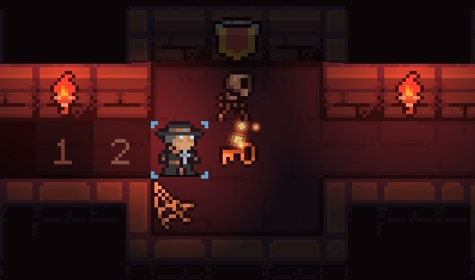
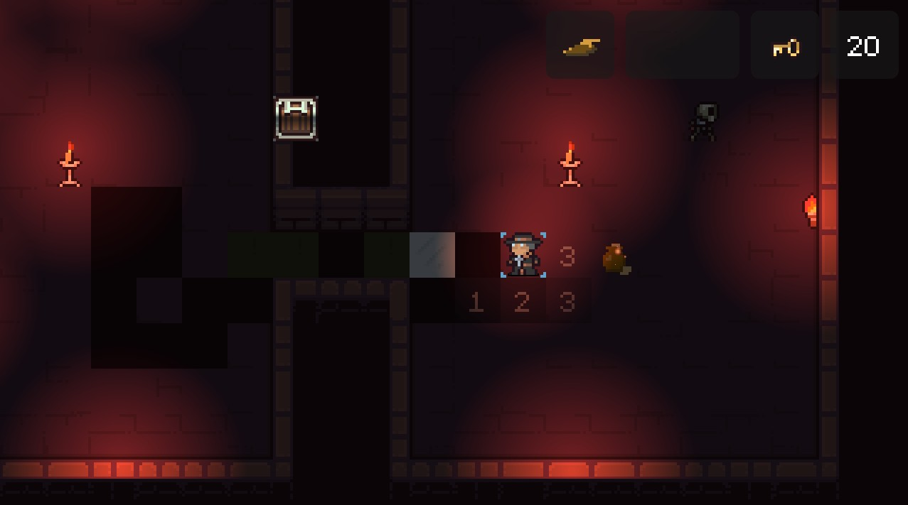
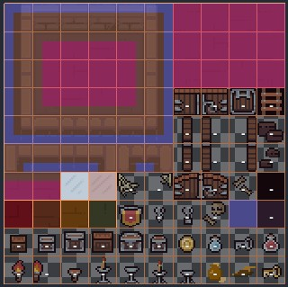
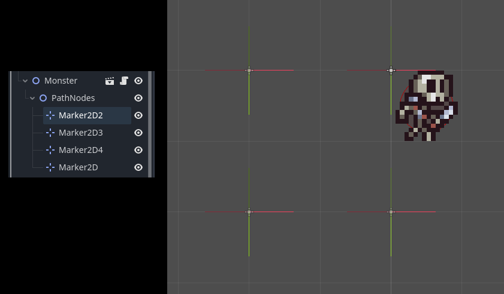

# BJAM Stage 1 Post Mortem

This project has been really motivating and I am looking forward to the next stages. And to play the game we eventually make!



## Features

The feature that made it into my prototype

 - Key to open door to finish level
 - Turnbased movement
 - Everything that can take time, act on your turn
 - Floors collapse after some turns
 - Tiles can be configured for how many turns they take to collapse
 - Pick up "bridge parts" to build a bridge instead of falling into a pit
 - Ice tiles that you slip on, force moving you to the next tile
 - Pick up "bag of sand" to avoid the forced movement
 - Monsters that move on a predetermined path, unless you make them fall

I also added lights that flicker (torches), lights and shadows in the world, and added particle effects for the pick up items so they would be easier to spot and understand is important. I also added a HUD that shows you which items you are carrying, since I allowed you 3 bags of sand and 1 bridge.




### What to keep for stage 2?

I feel very strongly that the turn based gameplay is a lot more interesting and fun than the real time (an earlier prototype didnt do turn based movement). The puzzles we can make is a lot more interesting when the world waits on you and act in a predictable way.

I think the ice and sand is a cool mechanic to mix up the puzzles.

Having tiles collapse on different timers may not be needed, but having a limited supply of "bridges" could make for interesting puzzles.

Simple, but predictable monsters also work well with the puzzle concept.

## Godot Components used and learned


### TileMap
They are key to making pixel art style maps on a grid and so helpful. I did attempt some collision/physics integration, but in the end found it best to drop that.



The terrain feature took some fiddling around and I eneded up with 3 of them to have the tiles match up. We dont have all variants, so some fiddling around when drawing maps is still required.


### TileSet Custom Data

For navigation and hazzards I ended up using Custom Data in the tileset. Boolean values for "wall", "pit" and "ice". And an integer for "decay" where it's value is the number of turns this tile will take to collaps. And a -1 means it won't.

It was super easy to add the two types of ice tiles combinding the decay and ice data points to have Ice that collaps and Ice that wont.


### Monsters on rails



To make the monster move in simple ways I created a naive pathing implementation. In the end this system ended up feeling just right. When the monster spawns it looks for a child node called PathNodes (which is NOT part of it's scene). And in it, looks for Marker2D nodes. It will move one grid closer to the first marker each turn until it is on the same tile, then it will target the next. The markers should be position so that the monster will only move in cardinal directions and will loop endlessly.


### Tween animations

The player, the monster and the decay all animated with tweens (except for the falling which uses AnimationPlayer). 

```gdscript
# Player movement
var move_duration: float = TurnManager.TURN_DURATION
var tween := create_tween()
tween.tween_property(self, "global_position", desired_global_pos, move_duration).set_ease(Tween.EASE_IN)
tween.tween_callback(move_ended.emit.bind(desired_location))
```

```gdscript
# Monster Movement
var tween: Tween = create_tween()
var move_duration: float = TurnManager.TURN_DURATION
tween.tween_property(self, "global_position", global_position + direction * Map.tile_size, move_duration)
tween.parallel().tween_property(sprite, "frame", 9, move_duration).from(0)
if Map.is_pit(_grid_position):
    tween.tween_interval(0.01)
    tween.tween_callback(fall)
tween.tween_callback(turn_complete.emit)
```

Tieing the tween duration to a shared global constant of `TURN_DURATION` made all the action animations line up perfectly. While using AnimationPlayer for the falling, I could make them more free flowing and independent. I found the feature of doing some tweens in parallel and some in chain to be very useful. Especially found the `tween_callback` feature to be useful, for example ending the tweens of all actors (except player) with emit on a signal the actor had provided to the turn manager to signify that they are done with their turn `tween.tween_callback(turn_complete.emit)`.


### Turn Manager

This piece of tech was a little hard to get right, but I am very happy with how it turned out.

#### How it works:

 1. The TurnManager listens to the event `player_initiated_turn`
 2. It increased the turn counter and emits a `turn_started` with the new turn count
 3. It calls each of the registered callbacks (without waiting), tracking how many
 4. It listens to each registered "I'm done" signal, tracking how many
 5. When it the two counts matches, it signals `turn_completed`.
 6. Player listens to `turn_complete` to allow new movement and UI to update the counter

#### Registering with the TurnManager

So you want to be an actor on the board? You need two things, a signal you send when you are done and a callback for the turn manager to call to tell you to start acting. Here is a simple example of an object that will turn red on it's turn. 

```gdscript
extends Node2D

signal turn_completed

func _ready() -> void:
	GameManager.register(turn, turn_completed)

func turn() -> void:
	var tween = create_tween()
	tween.tween_property($Sprite2D, "modulate", Color.RED, TurnManager.TURN_DURATION).from(Color.WHITE)
	tween.tween_callback(turn_completed.emit)
```

It is important to unregister if you want to leave the turn order, so any object that will queue_free itself must unregister first. If the example above wanted to only act a single turn, then it could add a 2nd callback to the turn method: `tween.tween_callback(_cleanup)`:

```gdscript
func _cleanup() -> void:
	GameManager.unregister(turn, turn_completed)
	queue_free.call_deferred()
```

#### Nitty Gritty

Registering and unregistering with the TurnManager is important to get right. So there needs to be some checks to ensure that we are registering proper callbacks and signals and that they are not already registered. For for the done signals we use the connection status as our registration.

If we had Interfaces we could have a shared interface that all actors implemented without inheritance and then they could register themself as an object with the TurnManager knowing what methods to call and what the signal would be called. Passing them as callable and signal reference like we do, allow each actor to implement their turn and signal as they see fit and the TurnManager does not need to know about it.

```gdscript
# turn_manager.gd

## Register yourself as an actor that wants to do something on each turn
func register(callback: Callable, done_signal: Signal) -> void:
	assert(callback is Callable)
	assert(done_signal is Signal)
	if callback in _callbacks:
		push_error("Already registered")
	else:
		_callbacks.append(callback)
	if done_signal.is_connected(_on_turn_taker_done):
		push_error("Already registered")
	else:
		done_signal.connect(_on_turn_taker_done)


## Cleanup before you die by unregistering yourself from the turn order
func unregister(callback: Callable, done_signal: Signal) -> void:
	assert(callback is Callable)
	assert(done_signal is Signal)
	if not callback in _callbacks:
		push_warning("Not registered")
	else:
		_callbacks.erase(callback)
	if done_signal.is_connected(_on_turn_taker_done):
		done_signal.disconnect(_on_turn_taker_done)
	else:
		push_error("Not registered")
```

Here we see how the actual turn is handled. The `start_turn` method is called when the Player has signaled a start of their turn. The player is then locked from making new moves (in the player class) until it gets the `turn_completed` signal. 

```gdscript
# turn_manager.gd

## Call each actor in the turn order
func start_turn() -> void:
	_current_turn += 1
	Events.turn_started.emit(_current_turn)
	_actors_this_turn = _callbacks.size()
	if _actors_this_turn == 0:
		return
	_done_counter = 0
	for c:Callable in _callbacks:
		if c.is_valid():
			c.call()
		else:
			push_error("Turn taker is not callable. Should have unregistered?")

# Reaction to each individual actor saying they are done
# Emits turn_completed if all are done
func _on_turn_taker_done() -> void:
	_done_counter += 1
	if _done_counter >= _actors_this_turn:
		Events.turn_completed.emit(_current_turn)
```


### Global Managers

I ended up with 3 global autoloads.

#### Game Manager

Having the player script and scene only focus on the movement and display of the player, while keeping the interactions between it and the rest of the game in this manager feels right. The GameManager keeps track of what items the player is holding and ties the different pieces of the game together through signals from the EventBus

#### Event Bus

To keep all components independent, I find the use of a shared event bus to be particularly useful. For example the key logic.

 1. The key sends a signal when it is picked up and destroys itself.
 2. The doorway hears this and lights up the door
 3. GameManager hears this and toggles the `has_key` variables

```gdscript
# key.gd
func pick_up() -> void:
	Events.key_picked_up.emit()
	queue_free()
```

```gdscript
# doorway.gd
func _ready() -> void:
	Events.key_picked_up.connect(_on_key_picked_up)

func _on_key_picked_up() -> void:
	match direction_to_door:
		Dir.NORTH: spotlight.position += Vector2.UP * Map.tile_size
		Dir.EAST: spotlight.position += Vector2.RIGHT * Map.tile_size
		Dir.SOUTH: spotlight.position += Vector2.DOWN * Map.tile_size
		Dir.WEST: spotlight.position += Vector2.LEFT * Map.tile_size
	spotlight.show()
```

```gdscript
# global_game_manager.gd
func _ready() -> void:
	Events.key_picked_up.connect(func(): has_key = true)
	Events.key_used.connect(func(): has_key = false)
```

In the GameManager, I use setters with signals to tell whoever needs to know when their values change. Whoever is usally the UI.

```gdscript
# global_game_manager.gd
var has_key: bool = false:
	set(v):
		if has_key != v:
			has_key = v
			Events.has_key_changed.emit(v)
var has_sand: bool:
	get:
		return sandbags > 0
var sandbags: int = 0:
	set(v):
		v = clampi(v, 0, MAX_SANDBAGS)
		if sandbags != v:
			sandbags = v
			Events.sandbags_changed.emit(v)
```

```gdscript
# hud.gd
func _ready() -> void:
	Events.has_key_changed.connect(_on_has_key_changed)
	Events.sandbags_changed.connect(_on_sandbags_changed)
	Events.bridge_picked_up.connect(_on_bridge_parts_changed.bind(true))
	Events.bridge_used.connect(_on_bridge_parts_changed.bind(false))

func _on_bridge_parts_changed(new_value: bool) -> void:
	bridge_parts.visible = new_value

func _on_has_key_changed(new_value: bool) -> void:
	has_key_hud.visible = new_value

func _on_sandbags_changed(new_value: int) -> void:
	var icons: Array[Node] = sandbags.get_children()
	icons[0].visible = new_value >= 1
	icons[1].visible = new_value >= 2
	icons[2].visible = new_value >= 3
```

NB! The quirck here is that the bdige parts are two events in the bus, but we only need one handler in the ui, so since we dont get the new value from the event, we bind the expected value to the handler ourselves here.

#### Map Manager

Mostly a utility class, it keeps a reference to the currently active tilemap and any code in the game that needs to know things like "what is the tilesize we are using?" or "if I am at this global position, what tile grid location is that?" can ask this manager.
